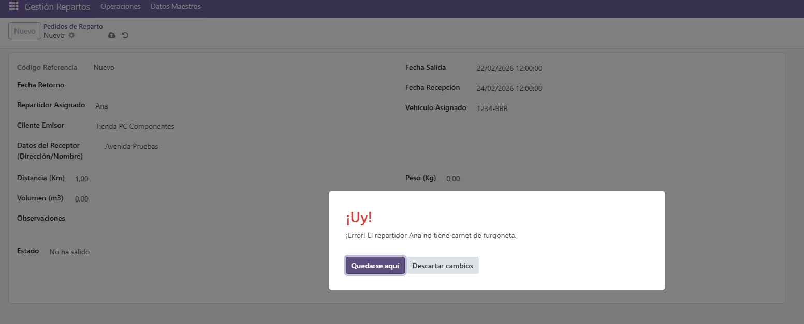
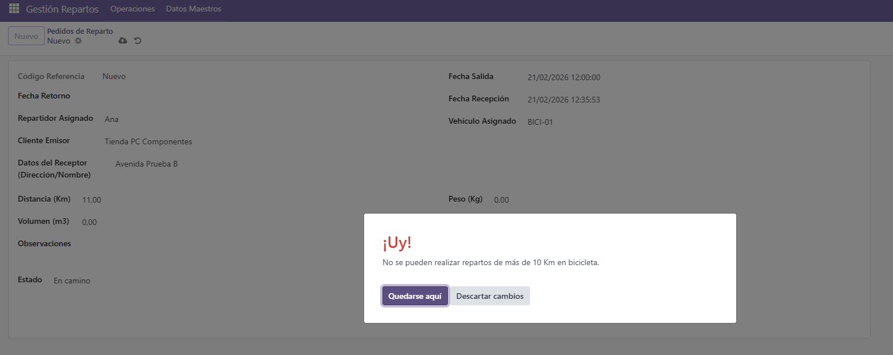
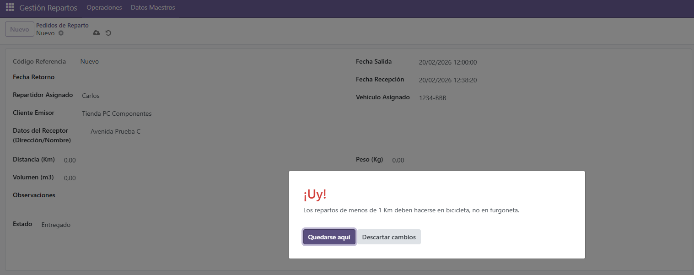
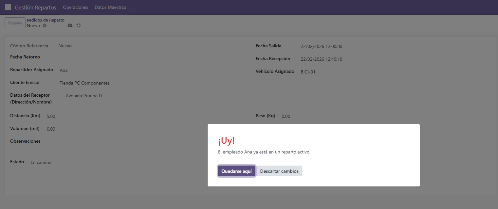
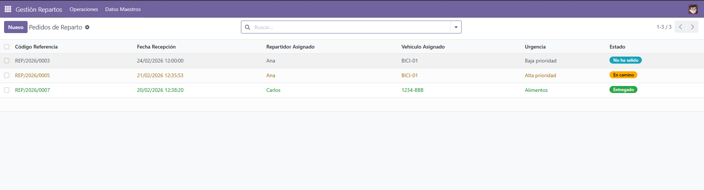
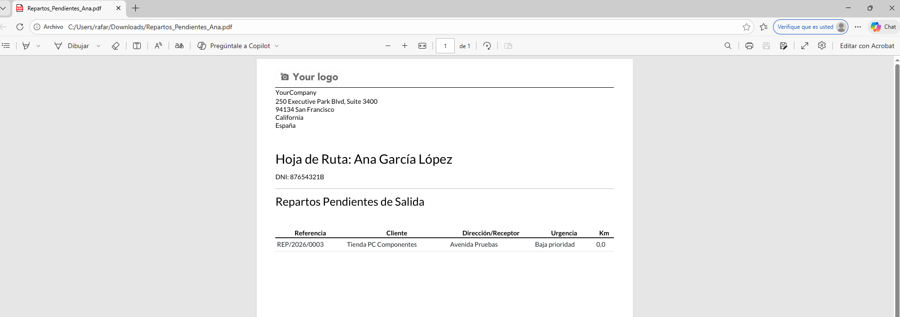

#  Odoo Module: Gestión de Repartos


Módulo personalizado para Odoo desarrollado como Proyecto Final de 2DAM. Su objetivo es digitalizar y automatizar la logística de una empresa de envíos, controlando la flota de vehículos, el personal de reparto y las asignaciones de pedidos bajo estrictas reglas de negocio.

##  Tabla de Contenidos
1. [Características Principales](#-características-principales)
2. [Estructura del Proyecto](#-estructura-del-proyecto)
3. [Modelos de Datos](#-modelos-de-datos)
4. [Reglas de Negocio (Backend)](#-reglas-de-negocio-backend)
5. [Interfaz de Usuario (Frontend)](#-interfaz-de-usuario-frontend)
6. [Funcionalidades Avanzadas](#-funcionalidades-avanzadas)
7. [Manual de Despliegue (Docker)](#-manual-de-despliegue-docker)

---

##  Características Principales

- **Gestión Integral:** Control total sobre Empleados, Vehículos, Clientes y Pedidos.
- **Validaciones Inteligentes:** Restricciones en tiempo real mediante `@api.constrains` para evitar asignaciones incorrectas (ej. control de carnets y distancias).
- **Interfaz Optimizada:** Vistas Tree con colores dinámicos (`badges`) y vistas Form estructuradas con `notebooks`.
- **Automatización:** Generación automática de códigos de pedido mediante `ir.sequence` (ej. `REP/2026/0001`).
- **Wizard de Creación Rápida:** Formulario emergente (`TransientModel`) para dar de alta repartos urgentes ágilmente.
- **Informes PDF:** Generación de Hojas de Ruta imprimibles (QWeb) por empleado con sus repartos pendientes.

---

##  Estructura del Proyecto

El módulo sigue la arquitectura MVC adaptada al framework de Odoo:

```text
gestion_repartos/
├── __init__.py
├── __manifest__.py        # Configuración general y dependencias
├── data/                  
│   └── data.xml           # Secuencias automáticas de códigos
├── models/                
│   ├── __init__.py
│   └── models.py          # Lógica de base de datos y validaciones
├── report/                
│   └── reparto_report.xml # Plantilla QWeb para informes PDF
├── security/              
│   └── ir.model.access.csv # Permisos de acceso a los modelos
├── views/                 
│   └── views.xml          # Interfaz de usuario (Menús, Formularios, Listas)
└── wizard/                
    ├── __init__.py
    ├── reparto_wizard.py       # Lógica del asistente rápido
    └── reparto_wizard_view.xml # Interfaz del asistente emergente
```

---

##  Modelos de Datos

El sistema se compone de cuatro entidades principales fuertemente relacionadas:

1. reparto.empleado: Gestiona datos del personal y permisos de conducción (ciclomotor/furgoneta). Relación One2many con el historial de pedidos.

2. reparto.vehiculo: Catálogo de la flota (Bicicleta/Furgoneta) y control de estado de disponibilidad.

3. reparto.cliente: Directorio de emisores de los paquetes.

4. reparto.pedido: Modelo central. Vincula cliente, repartidor y vehículo (Many2one). Incluye métricas de distancia (Km), nivel de urgencia y estado.

---

##  Reglas de Negocio (Backend)

El sistema garantiza la integridad de las operaciones mediante las siguientes validaciones programadas en Python:

- **Validación de Carnets:** Bloquea la asignación de un vehículo si el empleado no posee el carnet requerido.


- **Optimización de Distancias:**

  - Límite máximo de 10 Km para repartos en Bicicleta.
  - Límite mínimo de 1 Km para movilizar una Furgoneta.
  
  

- **Control de Concurrencia:** Impide asignar un empleado o vehículo a un nuevo reparto si ya se encuentran en un estado activo ("En camino").


---

##  Interfaz de Usuario (Frontend)

Las vistas se han diseñado para maximizar la usabilidad:

- **Vistas Tree (Lista):** Incorporan colores dinámicos (decoration-success, decoration-warning) y badges para identificar rápidamente el estado de los pedidos.


- **Vistas Form (Formulario):** Se utilizan elementos como <notebook> y <page> para agrupar la información del paquete de forma limpia y estructurada.

--- 

##  Funcionalidades Avanzadas

- **Asistente Rápido (Wizard):** Se ha implementado un TransientModel que despliega una ventana emergente para dar de alta repartos urgentes de forma ágil, minimizando los clics del usuario.

- **Informes PDF (QWeb):** Permite generar una "Hoja de Ruta" imprimible desde la ficha de cada empleado, filtrando únicamente los pedidos que están pendientes de salida.


- **Secuencias Automáticas:** Al crear un nuevo pedido, Odoo genera automáticamente un código único y secuencial con el formato REP/AÑO/NUMERO (ej. REP/2026/0001).

---

##  Manual de Despliegue (Docker)

Para levantar el entorno de desarrollo, se utiliza docker-compose:

**Requisitos Previos:** 

  - Tener Docker y Docker Compose instalados en el sistema.

**Pasos para Desplegar:**

  - Clonar el repositorio en el directorio local.

  - Configurar el archivo docker-compose.yml mapeando el volumen ./addons:/mnt/extra-addons.

  - Ejecutar el comando 
  ```bash 
  docker-compose up -d
  ```

  - Acceder a http://localhost:8069, activar el Modo Desarrollador, actualizar la lista de aplicaciones e instalar  "Gestión de Repartos".